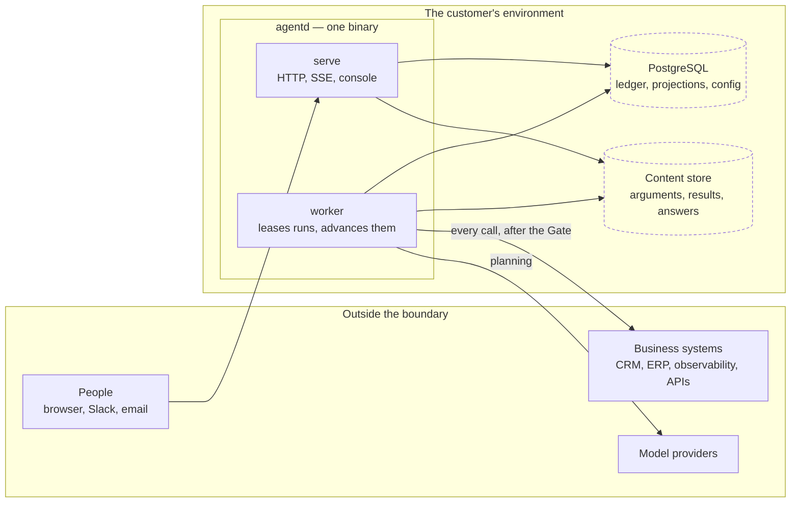

# FuseOne Agents

FuseOne Agents is a governed runtime and control plane for AI agents that work
inside real business operations: reading systems, proposing actions, asking for
approval when the risk calls for it, and leaving a traceable record of what
happened.

It is built for agents that touch CRM, ERP, support queues, observability
systems, internal APIs, secret stores and legacy tools. The product is not a
generic chat shell and not a vendor connector marketplace. MCP servers,
governed connector instances, channels and native platform tools are
capabilities that must be scoped, classified and evaluated before they can
change the outside world.

It installs into the customer's own environment. One binary, one PostgreSQL,
one Helm chart.

## The shape of it



One binary, one PostgreSQL, one Helm chart. `serve` answers people and `worker`
advances runs; they are two commands of the same binary and share nothing but
the database.

**Two stores, deliberately.** The ledger is append-only and hash-chained, so it
can never be edited — which is why the bulky, personal parts of a run live in
the content store instead: tool arguments, tool results and closing answers are
held by reference with a digest, under retention an erasure request can reach.
A record that cannot be corrected must not be a record that cannot be emptied.

**Nothing reaches a business system except through the Gate.** The arrow from
`worker` to those systems passes seven deterministic checks first, and both the
decision and its rule are appended to the ledger before the effect happens.

## What it does today

- Runs authored agents from manual starts, webhooks, events and channels.
- Connects MCP tool servers, discovers their tools, lets an operator choose
  the surface area, and requires a Curator to classify what each tool can do.
- Hosts governed connector instances, beginning with Vault, and exposes a
  connector catalogue for common governed shapes such as secrets, SQL reads,
  object storage, identity actions, DNS, Kubernetes, SMTP and governed HTTP.
- Evaluates every external effect through a deterministic Gate before anything
  reaches the outside world.
- Applies autonomy stages, approval policy, data barriers, taint labels,
  budgets, rate limits, duplicate-effect recognition and compensation before an
  agent acts.
- Carries labels from inputs, artifacts, memory, tool results and
  agent-to-agent events so a later write cannot quietly launder risky context.
- Records runs in an append-only, hash-chained ledger for replay, audit,
  simulation, regression checks, budget accounting and incident review.
- Stores large or sensitive run content behind references, so retention and
  erasure can remove what a run carried without rewriting the audit chain.
- Shares context between runs and agents through named artifacts whose refs,
  digests, scope labels and origin labels are controlled by the platform.
- Maintains governed memory as structured assertions, not remembered prose:
  evidence, labels, retention and erasure travel with the memory, and reading
  it can taint the next action.
- Explains cost and usage with FinOps views: prompt composition by source and
  tool, cache hits, compaction savings, price provenance, run spend, aggregate
  spend by model and agent, and simulation exposure before a run starts.
- Provides operational visibility through Prometheus metrics, durable runtime
  projections, a Needs attention cockpit and a Trust Center whose judgement is
  computed on the server.
- Ships with a console for authoring, approvals, run inspection, MCP and
  connector governance, audit trail, data retention, branding and the
  in-product manual.

## Why it is different

Most automation platforms ask whether an integration can call an API. FuseOne
asks a different question first: who decided this agent may do this thing, with
this input, in this scope, at this cost?

The run ledger is the source of truth for execution. Projections make expensive
questions fast to answer - cost, runtime health, memory, duplicate effects,
simulation and trust - but they carry coverage, scope and provenance instead of
pretending unknown is low or partial is complete.

The Gate's ruling is written before the effect happens. A grant can release an
action that only needed approval; it cannot override a check that blocked it.
Duplicate-effect recognition, memory, context sharing and connector calls all
keep that same rule: the platform decides what can be said, read, skipped or
written, and the model does not get to invent authority by text.

## Durable execution, deliberately bounded

FuseOne can resume a run after a process or worker failure because the run is
derived from its append-only ledger, not held in a worker's memory. Leases keep
one worker on a turn at a time; an expired lease lets another worker fold the
same steps and continue. Approval requests, parked runs, budget reservations
and recorded tool calls therefore survive a restart.

That is durable **agent execution**, not a claim to be a general-purpose
workflow engine. FuseOne interprets versioned agent definitions through one
fixed run loop. It does not expose arbitrary deterministic workflow code,
child workflows, general durable timers or a Temporal-compatible programming
model.

Nor does durability make an external effect exactly-once. If a remote system
commits a tool call and the worker dies before recording its result, FuseOne
records the outcome as unknown and keeps the call's idempotency key. The tool
or integration must still honor that key, be naturally idempotent, or offer a
compensation. A model request can likewise be billed again if its response was
not recorded before an ambiguous failure.

Use FuseOne for bounded agent investigations and actions that need Gate,
labels, approval, budgets, memory and an auditable trail. Put a durable
workflow engine beside it when the surrounding business process needs a
general workflow language, long-lived timers, broad fan-out, workflow-level
versioning or operational guarantees beyond the run loop FuseOne implements.

Design boundary: [NT-011](docs/NT-011-durable-agent-execution-and-workflow-engines.md).

Functional reference: [docs/PRD-001-fuseone-agents.md](docs/PRD-001-fuseone-agents.md).

## Installing

```sh
helm install agents oci://ghcr.io/fuseone-io/charts/fuseone-agents \
  --namespace fuseone --create-namespace --timeout 25m \
  --set secret.existingSecret=fuseone-agents \
  --set baseUrl=https://agents.example.com
```

`--timeout 25m` is not optional on an installation with memory to reconcile.
Helm defaults to five minutes and abandons the release when its hooks take
longer — the schema and the memory reconciliation both run as hooks, and no
chart can raise a client's timeout for it. Nothing is lost when that happens:
both hooks are resumable and running the command again continues where it
stopped. What is lost is the release.

Images are built in the open for `linux/amd64` and `linux/arm64`, and signed
with no key at all - the signature's identity is the workflow that built it.
This runs inside your network where you cannot watch it build, so check it
before it does:

```sh
cosign verify ghcr.io/fuseone-io/fuseone-agents:<version> \
  --certificate-identity-regexp '^https://github.com/fuseone-io/fuseone-agents/' \
  --certificate-oidc-issuer https://token.actions.githubusercontent.com
```

Installing, operating and proving it to an auditor:
[deploy/helm/fuseone-agents/README.md](deploy/helm/fuseone-agents/README.md).

## Releases

A release is a `v`-prefixed tag. `make release V=x.y.z` refuses a dirty tree,
runs the full local gate, creates the tag, and lets CI publish the versioned
image, `latest`, the OCI Helm chart, and a GitHub Release whose notes come from
the matching `CHANGELOG.md` section.

## Running it locally

```sh
make dev      # database, api, worker, console, and stand-ins for the model
              # provider and an MCP server — everything, one command
make stop     # end it, from any terminal
make reset    # throw the development database away and start over
```

`make dev` prints where the console is and the setup token to claim the
installation with. Nothing external is needed: no API key, no network.

```sh
make check       # build, vet, generated-code drift, tests, race
make check-pg    # the same suites against a real PostgreSQL
make smoke       # what the shipping binary serves, and what it refuses to
```

## Layout

```
cmd/agentd/     the product: serve | worker | start | bootstrap | keygen | migrate
cmd/devstack/   local stand-ins for a model provider and an MCP server
internal/
  domain/       core types. No I/O, stdlib only
  ledger/       the append-only hash-chained ledger and its projections
  gate/         deterministic checks and verdicts before external effects
  engine/       the loop: fold the ledger, decide the next action
  worker/       leases runs and advances them
  model/        provider adapters, prices and prompt assembly
  tools/        MCP catalogue, reservations, cache, egress and invocation
  connectors/   governed connector shapes and catalogue entries
  connectortools/ runtime bridge for governed connector instances
  memory/       governed memory assertions, suggestions, labels and retention
  dedupe/       cross-run duplicate-effect recognition
  contextshare/ named artifacts shared between runs and agents
  finops/       spend projections and aggregates
  channel/      channel inbox, delivery, reporter and operational evidence
  admin/        what operators change, and the record that they did
  auth/         OIDC, sessions, delegation
  httpapi/      HTTP + the OpenAPI contract's implementation
api/            openapi.yaml — the contract both sides are generated from
web/            the console: React 19 + Vite + shadcn/ui
docs/           PRD, data protection, operator docs, notes and manual pages
```

## The reasoning, written down

Every consequential decision here has a note arguing it, including what it
gives up. They are worth more than the code comments for anyone deciding
whether this design fits their problem.

| | |
|---|---|
| [PRD-001](docs/PRD-001-fuseone-agents.md) | What the product is, requirement by requirement |
| [DP-001](docs/DP-001-data-protection.md) | What is stored, what leaves the installation, and what can be erased |
| [OP-001](docs/OP-001-running-an-installation.md) | Installing it, the decisions an operator owns, and what to expect when something is wrong |
| [NT-001](docs/NT-001-integration-boundary-and-execution-model.md) | Where MCP ends and integration begins |
| [NT-002](docs/NT-002-remaining-work.md) | The remaining product work and why it is ordered that way |
| [NT-003](docs/NT-003-conversational-authoring.md) | Authoring an agent by conversation |
| [NT-004](docs/NT-004-ledger-volume-and-paging.md) | What the ledger costs at volume, measured, and why it is partitioned on the run's opening time |
| [NT-005](docs/NT-005-interaction-channels.md) | Channels, and why Slack and WhatsApp are two products |
| [NT-006](docs/NT-006-evaluating-agents.md) | Evaluating agents, and why not to adopt a harness |
| [NT-007](docs/NT-007-drawing-a-process.md) | A canvas that authors the stages, without the specification becoming a picture |
| [NT-008](docs/NT-008-a-catalogue-by-shape.md) | The tool servers to ship, chosen by shape and never by vendor |
| [NT-009](docs/NT-009-governed-connectors.md) | First-party connector shapes, and why runtime comes only after governance |
| [NT-010](docs/NT-010-the-shape-of-the-platform.md) | Topology, the run loop, layering and where data is written |
| [NT-011](docs/NT-011-durable-agent-execution-and-workflow-engines.md) | The durable run boundary, and when a workflow engine belongs beside it |

Engineering rules are in [CLAUDE.md](CLAUDE.md) for the Go core and
[web/CLAUDE.md](web/CLAUDE.md) for the console. Design notes and commits are in
English so public review has one shared language. The product manual lives in
[docs/manual](docs/manual) and is bilingual where the console needs it.
