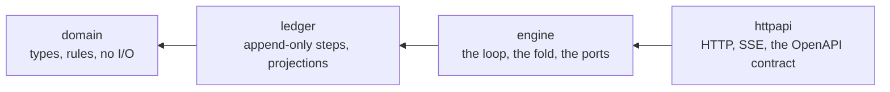
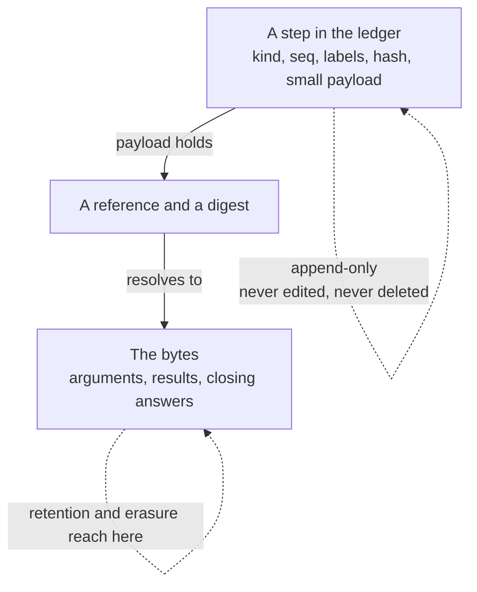

# NT-010 — The shape of the platform

Three drawings and what checks each one. The README shows what an operator
installs; this note shows what happens inside it, and how the pictures are kept
from drifting away from the code.

A diagram that disagrees with the code is worse than no diagram. It reads as
authoritative and nothing fails when it stops being true. So each drawing below
names what proves it, and where a drawing has no accuser this note says so
rather than leaving the reader to assume one exists.

## One run, from start to record

```mermaid
sequenceDiagram
  participant W as worker
  participant L as ledger
  participant M as model provider
  participant G as gate
  participant T as tool

  W->>L: read the run's steps
  Note over W: fold them into state<br/>(no state is stored; it is derived)
  W->>M: plan, given state and the tools this step may use
  M-->>W: one proposed call, or finish
  W->>G: evaluate(proposal, state, policy)
  G-->>W: allow · block · require approval · duplicate
  W->>L: append the decision and the rule that produced it
  alt allowed
    W->>T: invoke
    T-->>W: result, by reference
    W->>L: append the call and the result
  else refused
    Note over W: the refusal is returned to the model<br/>as final for this run
  end
  Note over W,L: repeat until the model calls finish,<br/>or the run parks for a person
```

**The fold is the whole design.** A run has no stored state — the state is a
pure function of the steps recorded so far, so a worker that dies mid-run is
replaced by another that reads the same ledger and reaches the same place. It is
also why the ledger has no `UPDATE` and no `DELETE`: a correction is a new step,
because amending an old one would change the answer the fold gives about the
past.

**The Gate sits between the proposal and the effect, always.** There is no path
from a model's suggestion to a business system that does not pass through it,
and the decision is appended before the effect happens rather than after — so a
crash between the two leaves a record that something was allowed, never a
mystery effect with no decision behind it.

*What proves it:* the engine tests drive this loop against an in-memory ledger,
and the gate tests drive the seven checks and four verdicts directly. The
ordering claim — decision appended before effect — is asserted in the runner's
tests.

## Which package may know which



Arrows are "may import". Nothing points the other way: `domain` is what
everything is built on, so it is built on nothing of ours and on no third party
except one named exception — Unicode normalisation, because memory identity is
wrong without it and the standard library does not ship the table.

Interfaces are declared by the consumer. `engine` declares the `Ledger` and
`ContentStore` it needs, and `ledger` implements them without importing
`engine` — which is why the arrow can point inward while the dependency of
meaning points outward.

*What proves it:* `internal/arch/layering_test.go` walks the import graph and
fails on a reverse arrow or a third-party import inside `domain`. It reads
production files for direction and every file for purity: a domain *test* that
reaches for a driver has put the driver in the package's world, but a ledger
*test* that imports `engine` is asserting at compile time that it satisfies
`engine.ContentStore` — the layering being proved rather than broken.

## What is written where



The split is not about size. Tool arguments and tool results routinely carry
personal data, and `run_steps` is the one table an erasure request can never
reach — so what an erasure has to be able to remove is never written there. The
step keeps the digest, which is enough for an auditor to prove which arguments
were used without the arguments surviving to prove it.

When the bytes are erased, anything resting on them is marked rather than left
looking sound: a governed memory whose evidence was erased becomes
`source_erased` and stops being recalled.

*What proves it:* the retention and erasure tests in `internal/admin`, and the
memory reconciliation suite, which drives an erased source through to the
memory that cited it. The drawing itself has no accuser — it describes a
convention held by review, not by a check.

## Related

- [DP-001](DP-001-data-protection.md) — stored data, retention, erasure, boundaries
- [NT-004](NT-004-ledger-volume-and-paging.md) — ledger volume, partitions, paging
- [PRD-001](PRD-001-fuseone-agents.md) — the product these shapes serve
